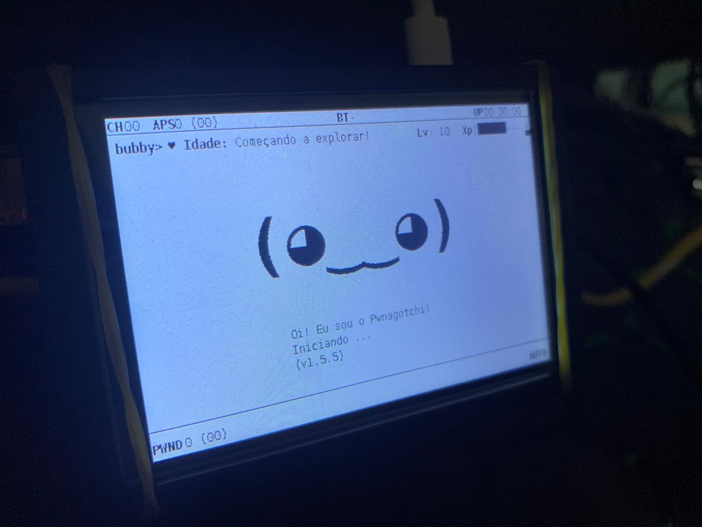

    
    
    
    

## Essa imagem teve uma pequena modificação para atender a um publico que usa Raspberry Pi3/3b/3b+

[Modificações](modificacao.md)

[Pwnagotchi](https://pwnagotchi.ai/) é uma "IA" baseada em [A2C](https://hackernoon.com/intuitive-rl-intro-to-advantage-actor-critic-a2c-4ff545978752), utilizando o [bettercap](https://www.bettercap.org/), que aprende com o ambiente Wi-Fi ao seu redor para maximizar o material de chaves WPA crackáveis que captura (de forma passiva ou realizando ataques de autenticação e associação). Esse material é coletado como arquivos PCAP contendo qualquer forma de handshake suportada pelo [hashcat](https://hashcat.net/hashcat/), incluindo [PMKIDs](https://www.evilsocket.net/2019/02/13/Pwning-WiFi-networks-with-bettercap-and-the-PMKID-client-less-attack/), handshakes completos e parciais de WPA.

Em vez de apenas jogar [Super Mario ou jogos do Atari](https://becominghuman.ai/getting-mario-back-into-the-gym-setting-up-super-mario-bros-in-openais-gym-8e39a96c1e41?gi=c4b66c3d5ced) como a maioria das "IAs" baseadas em aprendizado por reforço (jovem), o Pwnagotchi ajusta seus [parâmetros](https://github.com/evilsocket/pwnagotchi/blob/master/pwnagotchi/defaults.toml) ao longo do tempo para se tornar **melhor em capturar redes Wi-Fi** nos ambientes aos quais você o expõe.

Mais especificamente, o Pwnagotchi usa uma [LSTM com extrator de características MLP](https://stable-baselines.readthedocs.io/en/master/modules/policies.html#stable_baselines.common.policies.MlpLstmPolicy) como sua rede de políticas para o [agente A2C](https://stable-baselines.readthedocs.io/en/master/modules/a2c.html). Se você não está familiarizado com A2C, aqui está uma [explicação introdutória muito boa](https://hackernoon.com/intuitive-rl-intro-to-advantage-actor-critic-a2c-4ff545978752) (em forma de quadrinhos!) sobre os princípios básicos de como o Pwnagotchi aprende. (Você pode ler mais sobre como o Pwnagotchi aprende no documento de[Uso](https://www.pwnagotchi.ai/usage/#training-the-ai).)

**Lembre-se:** Ao contrário das simulações de aprendizado por reforço usuais, o Pwnagotchi aprende ao longo do tempo. O tempo para um Pwnagotchi é medido em épocas; uma única época pode durar de alguns segundos a minutos, dependendo de quantos pontos de acesso e estações de clientes estão visíveis. Não espere que seu Pwnagotchi tenha um desempenho incrível logo no início, pois ele estará [explorando](https://hackernoon.com/intuitive-rl-intro-to-advantage-actor-critic-a2c-4ff545978752) várias combinações de [parâmetros-chave](https://www.pwnagotchi.ai/usage/#training-the-ai) para determinar os ajustes ideais para o ambiente específico ao qual você o expõe durante suas primeiras épocas ... mas ouça seu Pwnagotchi quando ele disser que está entediado! Leve-o para novos ambientes Wi-Fi com você, deixe-o observar novas redes e capturar novos handshakes — e você verá. :)

Múltiplas unidades próximas fisicamente podem "conversar" entre si, anunciando sua presença através da transmissão de elementos de informação personalizados usando um protocolo parasita que construí sobre o padrão dot11 existente. Com o tempo, duas ou mais unidades treinadas juntas aprenderão a cooperar ao detectar a presença uma da outra, dividindo os canais disponíveis entre elas para maximizar a eficiência da captura.

## Documentação
https://www.pwnagotchi.ai

## Links
 	
&nbsp; | Links Oficiais
---------|-------
Website | [pwnagotchi.ai](https://pwnagotchi.ai/)
Forum | [community.pwnagotchi.ai](https://community.pwnagotchi.ai/)
Slack | [pwnagotchi.slack.com](https://invite.pwnagotchi.ai/)
Subreddit | [r/pwnagotchi](https://www.reddit.com/r/pwnagotchi/)
Twitter | [@pwnagotchi](https://twitter.com/pwnagotchi)

## Licença

`pwnagotchi` foi feito com ♥ por [@evilsocket](https://twitter.com/evilsocket) e o incrível time de desenvolvedores. Ele é lançado sob a licença GPL3.

